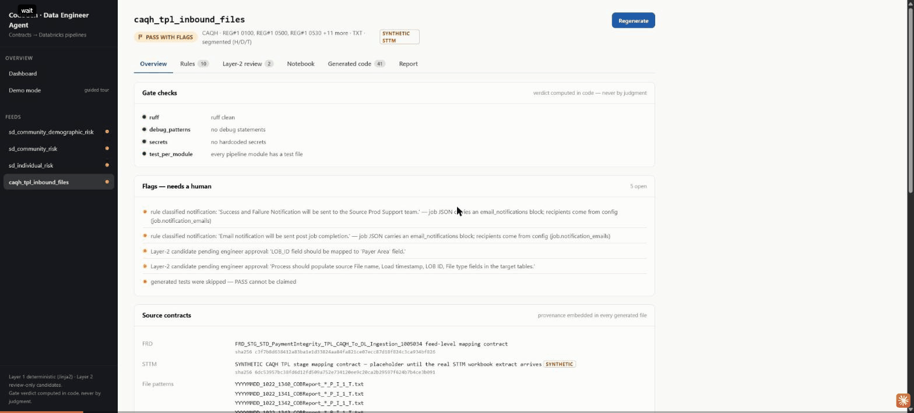
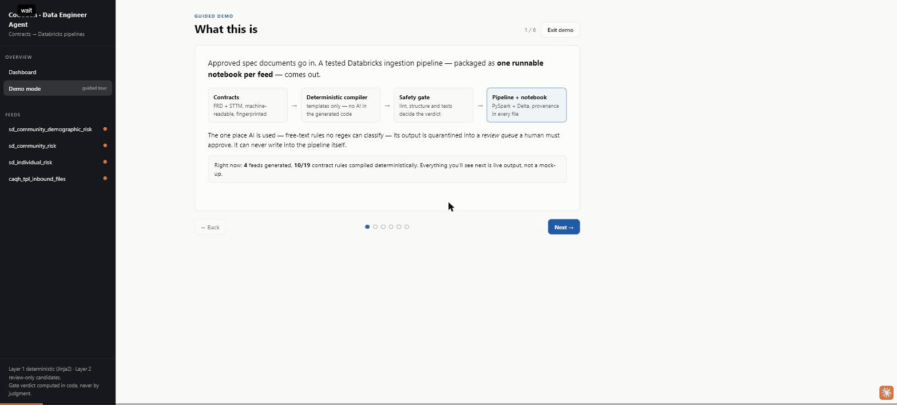

# Demo UI — React + FastAPI

A thin front door onto the generator: it invokes the same in-process pipeline
the CLI runs (`resolve → compile rules → Layer 2 → render → gate → report`)
and renders its structured artifacts. No generation logic lives in the UI.

## Run — single-port mode (Apps-shaped, recommended for demos)

One process serves the API and the built frontend, mirroring the shape a
Databricks Apps deployment expects:

```bash
.venv/bin/pip install -e ".[ui]"          # first time only
./run_demo.sh                              # builds frontend if stale, serves http://localhost:8571
```

The backend mounts `ui/frontend/dist` at `/` (with an index.html fallback
for client-side routes, and a no-store HTML shell so rebuilds never leave a
stale cached page) whenever a build exists. Port/host resolution:
`DATABRICKS_APP_PORT` (injected by Databricks Apps) → `CODEGEN_UI_PORT` →
`8571`; bind host is `0.0.0.0` (Apps requirement) unless `CODEGEN_UI_HOST`
overrides it. If config/fixtures are missing at startup, the app comes up
with empty state and reports the problem via `/api/feeds` instead of
crashing.

## Run — dev mode (two terminals, from the repo root)

```bash
# 1. Backend — generates all feeds on startup (dry-run, tests skipped)
CODEGEN_UI_DEV=1 .venv/bin/uvicorn ui.backend.main:app --reload --port 8571

# 2. Frontend
cd ui/frontend
npm install                                # first time only
npm run dev                                # http://localhost:5173
```

`CODEGEN_UI_DEV=1` enables the CORS allowance for the Vite origin. (The
Vite proxy makes most /api calls same-origin anyway, so dev usually works
without it, but set it to be safe.) Single-port mode is same-origin and
needs no CORS.

## Run modes (Live / Replay / Mock)

The **Run modes** page picks how results are produced; a badge + banner
always show which mode the UI is in:

- **Mock** (default): deterministic stand-in provider, zero network — what
  the startup generation and the "Generate all feeds" button run.
- **Replay**: loads a tracked live run from `fixtures/replay/<set>/`
  instantly — the deterministic pipeline re-runs locally with the recorded
  Anthropic candidates injected; zero API calls, no key needed.
- **Live** (card titled "Generate a Pipeline"): the full pipeline for real —
  **choose an STTM workbook**, then extract-sttm on it → generate with live
  Layer-2 reasoning → gate. The choice is enforced: the card opens at
  "none chosen" and the run button stays disabled until a pick; the picker
  (`GET /api/demo/workbooks`, `POST`/`DELETE /api/demo/workbook`) scans the
  fixtures workbook dir plus the `inputs/sharepoint` landing folder, a Clear
  button returns to "none chosen", and the selection can't change mid-run
  (409). The "Convention check" panel (real-FRD values read live from the
  docx) exists only where that document exists — in the ACFC port it reads
  from the client's own inputs dir; absent the document, the panel is
  simply absent. The card also surfaces **known input gaps** — coding standards
  document, real FRD with actual file paths — as attach slots backed by
  `GET /api/demo/input-documents`, a live scan of `inputs/sharepoint`
  (listing only; the generator does not consume these yet, and runs proceed
  without them with an explicit not-an-accurate-case caveat). Gated on a key
  being present in the backend env, requires an explicit cost confirmation
  (~3 calls, ≈$0.10), rejects concurrent runs (409), and writes to an
  isolated `out/demo_<timestamp>/` directory. `POST /api/generate` is
  hardwired to mock — the confirmed live endpoint is the only billed path —
  and with `contracts.pairs` empty it refuses loudly (409) before touching
  any loaded state.

The guided demo tour ends on the Layer-2 **human review** step in every
mode: candidates sit pending engineer approval until a person decides.

## What it shows

- **Dashboard** — one card per resolved feed with the three-state gate
  verdict (PASS / PASS WITH FLAGS / FAIL), rule-classification breakdown,
  and pending Layer-2 reviews. "Generate all feeds" re-runs the pipeline.
- **Feed detail**
  - *Overview* — gate checks, open flags, contract provenance (name +
    sha256), target tables, load semantics.
  - *Rules* — every FRD validation rule with its deterministic
    classification and the grounding substring that fired it.
  - *Layer-2 review* — candidates from `out/<feed>/candidates/`, with
    approve / reject. Decisions persist to `ui/backend/state/decisions.json`
    (gitignored) and are a review record only — **merging an approved
    candidate into generated code remains a manual v2 step.**
  - *Notebook* — the assembled `out/<feed>/<feed>.ipynb` rendered
    cell-by-cell (markdown as prose, code highlighted) — the single
    runnable deliverable per feed.

    
  - *Generated code* — file tree + syntax-highlighted viewer over
    `out/<feed>/`.
  - *Report* — the rendered markdown generation report from `reports/`.
- **Demo mode** (`/demo`) — a six-step guided tour for live demos
  (what it is → contracts → Layer 1 → Layer 2 → gate → the notebook
  deliverable). Every number and quote on screen is real output from the
  latest run; navigate with the buttons or ← / → keys. The final step
  renders the generated notebook **inline** — pick any feed's `.ipynb`
  and scroll it without leaving the tour.

  

## Notes

- The backend always runs the mock Layer-2 provider and skips generated
  tests (`dry_run=True`, `skip_tests=True` in `POST /api/generate`) — the
  full Spark gate stays a CLI concern.
- The Vite dev server proxies `/api` to `localhost:8571`
  (`ui/frontend/vite.config.ts`).
- `playwright` in devDependencies is only used for ad-hoc screenshot
  verification; the app itself doesn't need it.
